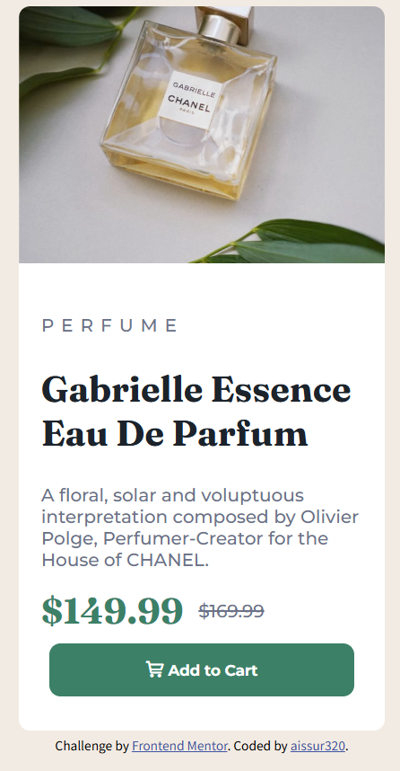
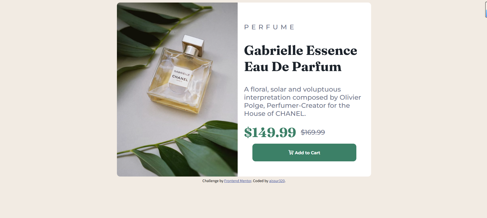

# Frontend Mentor - Product preview card component solution

This is a solution to the [Product preview card component challenge on Frontend Mentor](https://www.frontendmentor.io/challenges/product-preview-card-component-GO7UmttRfa). Frontend Mentor challenges help you improve your coding skills by building realistic projects. 

## Table of contents

- [Overview](#overview)
  - [The challenge](#the-challenge)
  - [Screenshot](#screenshot)
  - [Links](#links)
- [My process](#my-process)
  - [Built with](#built-with)
  - [What I learned](#what-i-learned)
  - [Continued development](#continued-development)
  - [Useful resources](#useful-resources)
- [Author](#author)
- [Acknowledgments](#acknowledgments)


## Overview

### The challenge

Users should be able to:

- View the optimal layout depending on their device's screen size
- See hover and focus states for interactive elements

### Screenshot






### Links

- Solution URL: [https://github.com/aissur320/Web---------/tree/main/Frontend%20Mentor/product-preview-card-component-main/product-preview-card-component-main]
- Live Site URL: [https://aissur320.github.io/product-preview-card-component-main/product-preview-card-component-main/index.html]

## My process

### Built with

- HTML
- CSS
- JavaScript
- [Styled Components](https://fonts.google.com/) - For font styles
- [Styled Components](https://www.iconfont.cn/?spm=a313x.collections_detail.i3.2.7f313a81sZD9QY)- For font styles

### What I learned

Use this section to recap over some of your major learnings while working through this project. Writing these out and providing code samples of areas you want to highlight is a great way to reinforce your own knowledge.

To see how you can add code snippets, see below:

```html
<h1>Not one</h1>
```
```css
#price-discount{
    color: hsl(158, 36%, 37%);
    font-size: 2em;
    padding-right: 10px;
    vertical-align: middle; /* make the row-center of the span in the same height */
}

#price-standard{
    font-weight: 500;
    color: hsl(228, 12%, 48%);
    text-decoration: line-through;
    vertical-align: middle; /* make the row-center of the span in the same height */
}

@media (min-width: 775px) {
    #main{
        width: 800px;
        height: 550px;
        display: flex;
        align-items: center;
        font-size: 1.3em;
    }

    #main-image{
        width: 50%;
        height: 100%;
        object-fit: cover;
        object-position: center;
        border-top-right-radius: 0;
        /* Reset the value of the element when changing the device */
        border-bottom-left-radius: 10px;
    }

    #main-text{
        width: 50%;
    }
}
```
```js
function updateImageSrc() {
      const img = document.getElementById('main-image');
      if (window.innerWidth <= 775) {
        img.src = './images/image-product-mobile.jpg';
      } else {
        img.src = './images/image-product-desktop.jpg';
      }
    }
    // Use this code to control which image to display while changing the device.
```


### Continued development

Use this section to outline areas that you want to continue focusing on in future projects. These could be concepts you're still not completely comfortable with or techniques you found useful that you want to refine and perfect.


### Useful resources

- [iconfont](https://www.iconfont.cn/?spm=a313x.collections_detail.i3.2.7f313a81sZD9QY) - This helped me engaging the icon I want to use in my pages.


## Author

- Website - [aissur320](https://github.com/aissur320)


## Acknowledgments

This is where you can give a hat tip to anyone who helped you out on this project. Perhaps you worked in a team or got some inspiration from someone else's solution. This is the perfect place to give them some credit.

