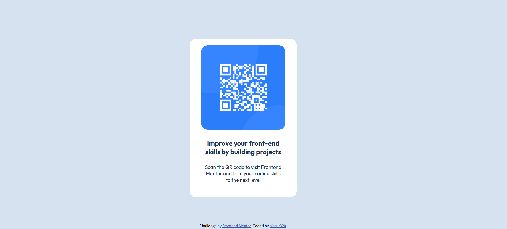

# Frontend Mentor - QR code component solution

This is a solution to the [QR code component challenge on Frontend Mentor](https://www.frontendmentor.io/challenges/qr-code-component-iux_sIO_H). Frontend Mentor challenges help you improve your coding skills by building realistic projects. 

## Table of contents

- [Overview](#overview)
  - [Screenshot](#screenshot)
  - [Links](#links)
- [My process](#my-process)
  - [Built with](#built-with)
  - [What I learned](#what-i-learned)
  - [Continued development](#continued-development)
  - [Useful resources](#useful-resources)
- [Author](#author)
- [Acknowledgments](#acknowledgments)


## Overview

### Screenshot



### Links

- Solution URL: (https://github.com/aissur320/Web---------/blob/main/Frontend%20Mentor/qr-code-component-main/qr-code-component-main/index.html)

## My process
  Firt I see the preview picture and come to my sense that they will be a big div in the center of the page, which includes an image of QR code, two paragraphs of words. 
  Then I start with the whole page stucture, add <div> and <p> to the <body>, and put them all in the center.
  At this time, comes the very first problem of the solution. I can't put the div box the way I want it to be put.
  I want the whole box to be in the center of the page, so I user margin:0 auto; text-align:center; in the box css erea.
  But it doesn't work, so I come out using the display:flex; justify-content: center; align-items: center; in the css erea of the body. After that, I get the correct box set. Things left is to put the eliments into the box, which is not a big deal.

### Built with

- HTML
- CSS
- [Styled Components](https://fonts.google.com/) - For font styles

### What I learned

Use this section to recap over some of your major learnings while working through this project. Writing these out and providing code samples of areas you want to highlight is a great way to reinforce your own knowledge.

To see how you can add code snippets, see below:

```html
<h1>Not one</h1>
```
```css
.proud-of-this-css {
  color: papayawhip;
}
```
```js
const proudOfThisFunc = () => {
  console.log('Not one')
}
```

### Continued development

Use this section to outline areas that you want to continue focusing on in future projects. These could be concepts you're still not completely comfortable with or techniques you found useful that you want to refine and perfect.

**Note: Delete this note and the content within this section and replace with your own plans for continued development.**

### Useful resources

- [Example resource 1](https://www.example.com) - This helped me for XYZ reason. I really liked this pattern and will use it going forward.
- [Example resource 2](https://www.example.com) - This is an amazing article which helped me finally understand XYZ. I'd recommend it to anyone still learning this concept.

**Note: Delete this note and replace the list above with resources that helped you during the challenge. These could come in handy for anyone viewing your solution or for yourself when you look back on this project in the future.**

## Author

- Website - [aissur320](https://github.com/aissur320)

## Acknowledgments

This is where you can give a hat tip to anyone who helped you out on this project. Perhaps you worked in a team or got some inspiration from someone else's solution. This is the perfect place to give them some credit.


