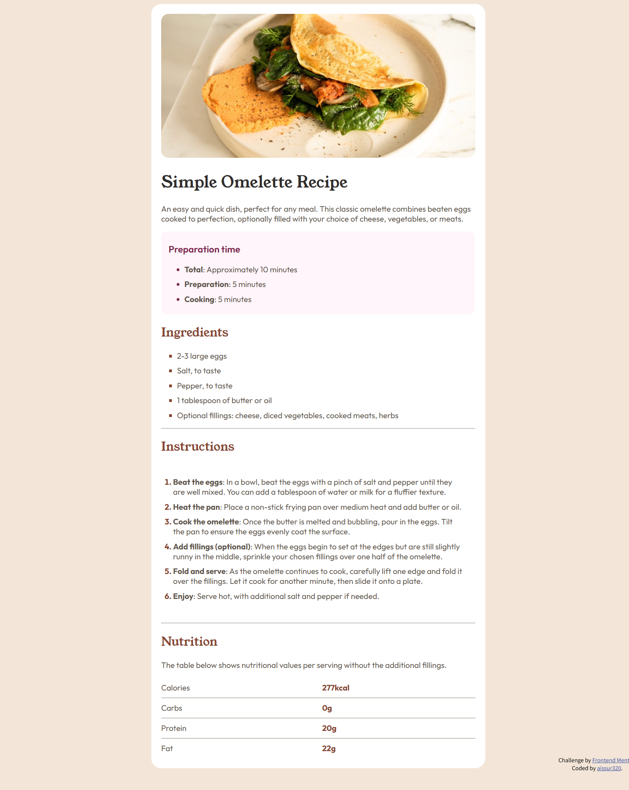

# Frontend Mentor - Recipe page solution

This is a solution to the [Recipe page challenge on Frontend Mentor](https://www.frontendmentor.io/challenges/recipe-page-KiTsR8QQKm). Frontend Mentor challenges help you improve your coding skills by building realistic projects. 

## Table of contents

- [Overview](#overview)
  - [The challenge](#the-challenge)
  - [Screenshot](#screenshot)
  - [Links](#links)
- [My process](#my-process)
  - [Built with](#built-with)
  - [What I learned](#what-i-learned)
  - [Continued development](#continued-development)
  - [Useful resources](#useful-resources)
- [Author](#author)
- [Acknowledgments](#acknowledgments)


## Overview

### Screenshot




### Links

- Solution URL: [https://github.com/aissur320/Web---------/tree/main/Frontend%20Mentor/recipe-page-main/recipe-page-main]
- Live Site URL: [https://aissur320.github.io/recipe-page-main/recipe-page-main/index.html]

## My process

### Built with

- HTML
- CSS
- [Styled Components](https://fonts.google.com/) - For font styles


### What I learned

Use this section to recap over some of your major learnings while working through this project. Writing these out and providing code samples of areas you want to highlight is a great way to reinforce your own knowledge.

To see how you can add code snippets, see below:

```html
<ul class="outfit-font" id="pre">
  <li><span>Total</span>: Approximately 10 minutes</li>
  <li><span>Preparation</span>: 5 minutes</li>
  <li><span>Cooking</span>: 5 minutes</li>
</ul>
```
```css
#pre{
    padding-left: 1.5em;
}

#pre li::marker{
    /* font-size: 80%; */
    color: hsl(332, 51%, 32%);
}

#pre li{
    margin-left: 0.5em;
}
```
```js
const proudOfThisFunc = () => {
  console.log('Not ont')
}
```

### Continued development

Use this section to outline areas that you want to continue focusing on in future projects. These could be concepts you're still not completely comfortable with or techniques you found useful that you want to refine and perfect.

**Note: Delete this note and the content within this section and replace with your own plans for continued development.**

### Useful resources

- [Example resource 1](https://www.example.com) - This helped me for XYZ reason. I really liked this pattern and will use it going forward.
- [Example resource 2](https://www.example.com) - This is an amazing article which helped me finally understand XYZ. I'd recommend it to anyone still learning this concept.


## Author

- Website - [aissur320](https://github.com/aissur320)


## Acknowledgments

This is where you can give a hat tip to anyone who helped you out on this project. Perhaps you worked in a team or got some inspiration from someone else's solution. This is the perfect place to give them some credit.

