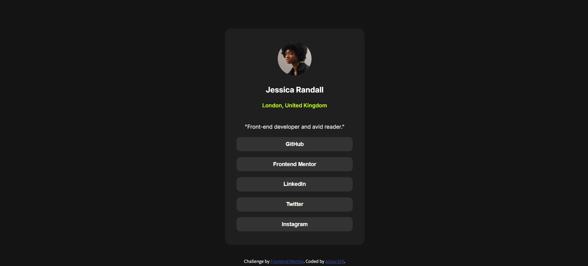

# Frontend Mentor - Social links profile solution

This is a solution to the [Social links profile challenge on Frontend Mentor](https://www.frontendmentor.io/challenges/social-links-profile-UG32l9m6dQ). Frontend Mentor challenges help you improve your coding skills by building realistic projects. 

## Table of contents

- [Overview](#overview)
  - [The challenge](#the-challenge)
  - [Screenshot](#screenshot)
  - [Links](#links)
- [My process](#my-process)
  - [Built with](#built-with)
  - [What I learned](#what-i-learned)
  - [Continued development](#continued-development)
  - [Useful resources](#useful-resources)
- [Author](#author)
- [Acknowledgments](#acknowledgments)


## Overview

### The challenge

Users should be able to:

- See hover and focus states for all interactive elements on the page

### Screenshot




### Links

- Solution URL: [https://github.com/aissur320/Web---------/blob/main/Frontend%20Mentor/social-links-profile-main/social-links-profile-main/index.html]
- Live Site URL: [https://aissur320.github.io/social-links-profile-main/social-links-profile-main/index.html]

## My process

### Built with

- HTML
- CSS
- [Styled Components](https://fonts.google.com/) - For font styles


### What I learned

Using the combination of button and hover, I make the bottons of my page clean and interactable. I'll make it to the real time work.

To see how you can add code snippets, see below:

```html
<div id="button-container" class="inter-font">

      <button id="github">GitHub</button>

      <button id="frontent_mentor">Frontend Mentor</button>

      <button id="linkedin">LinkedIn</button>

      <button id="twitter">Twitter</button>

      <button id="instagram">Instagram</button>

    </div>
```
```css
button{
    background-color: hsl(0, 0%, 20%);
    color: white;
    width: 300px;
    padding: 10px 20px;
    font-weight: 600;
    font-size: 14px;
    border: none;
    border-radius: 10px;
    cursor: pointer;
    transition: background-color 0.3s;
}

button:hover{
    background-color: hsl(0, 0%, 30%);
}
```
```js
const proudOfThisFunc = () => {
  console.log('Not one')
}
```


### Continued development

Use this section to outline areas that you want to continue focusing on in future projects. These could be concepts you're still not completely comfortable with or techniques you found useful that you want to refine and perfect.


### Useful resources

- [Example resource 1](https://www.example.com) - This helped me for XYZ reason. I really liked this pattern and will use it going forward.
- [Example resource 2](https://www.example.com) - This is an amazing article which helped me finally understand XYZ. I'd recommend it to anyone still learning this concept.


## Author

- Website - [aissur320](https://github.com/aissur320)


## Acknowledgments

This is where you can give a hat tip to anyone who helped you out on this project. Perhaps you worked in a team or got some inspiration from someone else's solution. This is the perfect place to give them some credit.

